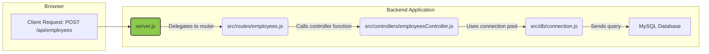

# EmPay Backend: `server.js` Explained

This document provides a detailed breakdown of the main entry point for the EmPay backend application, `server.js`. It explains what the code does and how it communicates with other files in the project to create a functioning REST API.

---

## 1. Code Breakdown of `server.js`

The `server.js` file is responsible for initializing the Express application, setting up middleware, defining the API routes, and starting the server.

### a. Imports

```javascript
const express = require('express');
const cors = require('cors');
require('dotenv').config();

// Import routes
const authRoutes = require('./src/routes/auth');
// ... other route imports
```

*   **`express`**: This is the core web framework for Node.js that simplifies building the API.
*   **`cors`**: A middleware package that handles Cross-Origin Resource Sharing. This is crucial because the frontend (e.g., running on `localhost:5173`) and backend (e.g., running on `localhost:5000`) are on different "origins," and browsers would otherwise block the communication between them for security reasons.
*   **`dotenv`**: This utility loads environment variables from a `.env` file into `process.env`. This is used to keep sensitive information like database credentials and server ports out of the source code.
*   **Route Imports**: Each `require('./src/routes/...')` statement imports a router object from a file in the `src/routes` directory. Each of these files defines the specific API endpoints for a particular feature (e.g., `auth.js` handles login, `employees.js` handles employee data).

### b. Application Initialization & Middleware

```javascript
const app = express();

// Middleware
app.use(cors({ ... }));
app.use(express.json());
app.use(express.urlencoded({ extended: true }));
app.use('/uploads', express.static(path.join(__dirname, 'uploads')));
```

*   **`const app = express()`**: This line creates an instance of the Express application. `app` is the central object used to configure the server.
*   **`app.use(...)`**: This function registers "middleware." Middleware are functions that process incoming requests before they reach their final destination (the route handler). They are executed in the order they are registered.
    *   **`cors()`**: Enables and configures CORS. The configuration here specifically allows requests from any `localhost` origin, which is perfect for local development.
    *   **`express.json()`**: Parses incoming requests with JSON payloads (i.e., it takes a JSON string in a request body and makes it available as a JavaScript object on `req.body`).
    *   **`express.urlencoded()`**: Parses incoming requests with URL-encoded payloads (e.g., from a standard HTML form submission).
    *   **`express.static()`**: This serves static files. The line `app.use('/uploads', ...)` makes any files in the `empay-backend/uploads` directory accessible to the public via URLs starting with `/uploads`. This is used for serving uploaded documents like leave attachments.

### c. API Routes

```javascript
// Health check
app.get('/api/health', (req, res) => { ... });

// Routes
app.use('/api/auth', authRoutes);
app.use('/api/employees', employeesRoutes);
// ... other app.use for routes
```

This is the core of the API's routing logic.
*   **`app.use('/api/auth', authRoutes)`**: This tells Express that for any request whose URL starts with `/api/auth`, it should hand off the request to the `authRoutes` router that was imported earlier.
*   For example, if the frontend sends a `POST` request to `/api/auth/login`, `server.js` matches the `/api/auth` prefix and passes the request to `auth.js`, which then handles the `/login` part.

### d. Error Handling & Server Start

```javascript
// 404 handler
app.use((req, res) => { ... });

// Error handler
app.use((err, req, res, next) => { ... });

const PORT = process.env.PORT || 5000;
app.listen(PORT, () => { ... });
```

*   **404 Handler**: This middleware is placed after all the valid routes. If a request makes it this far, it means it didn't match any of the defined API routes, so a "404 Not Found" error is returned.
*   **Global Error Handler**: This is a special middleware that catches any errors that occur in the application (e.g., a database error in a controller). It prevents the server from crashing and sends a generic "500 Internal Server Error" response.
*   **`app.listen(PORT, ...)`**: This is the command that actually starts the server. It tells the application to listen for incoming HTTP requests on the specified `PORT` (5000 by default).

---

## 2. How `server.js` Communicates with Other Files

`server.js` acts as the central conductor of the entire backend application. It doesn't contain any business logic itself; instead, it delegates tasks to other specialized files.



### The Communication Flow:

1.  **Request Arrives at `server.js`**: An HTTP request from the frontend (e.g., `POST /api/employees`) first hits the `server.js` file.
2.  **`server.js` -> Route File**: `server.js` examines the URL. It sees the `/api/employees` prefix and, based on the line `app.use('/api/employees', employeesRoutes)`, it passes the request object (`req`) and response object (`res`) to the router defined in **`src/routes/employees.js`**.
3.  **Route File -> Controller File**: The `employees.js` router looks at the rest of the URL and the HTTP method. For a `POST` request to the root (`/`), it has a definition like `router.post('/', create)`. This tells it to call the `create` function, which it imports from **`src/controllers/employeesController.js`**.
4.  **Controller File -> Database Connection**: The `create` function in the controller contains the actual business logic (validating data, hashing passwords, etc.). When it needs to interact with the database, it uses the connection pool imported from **`src/db/connection.js`** to execute SQL queries.
5.  **Response Travels Back**: Once the controller finishes its work (e.g., after the database confirms the new employee is created), it uses the `res` object (e.g., `res.status(201).json(...)`) to send a response. This response travels all the way back up the chain and is ultimately sent to the frontend client.

In summary, **`server.js` is the entry point and central router**. It uses middleware for common tasks and delegates all feature-specific logic to the `routes` files, which in turn delegate the business logic to the `controllers`, which finally communicate with the `database`. This clean separation of concerns makes the application organized, modular, and easy to maintain.
