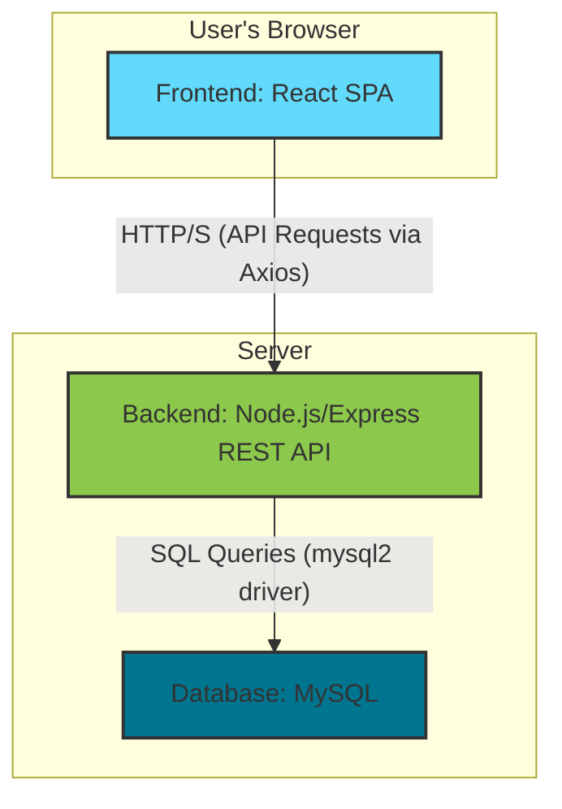

# EmPay HRMS: Tech Stack & Architecture Overview

This document outlines the technology stack, architecture, and a typical workflow for the EmPay HRMS project.

---

## 1. Technology Stack

The EmPay HRMS is built using a modern, robust, and widely-adopted set of technologies known as the **MERN stack** (MySQL variant) and other industry-standard tools. This stack was chosen for its performance, scalability, and extensive developer community.

### Frontend (Client-Side)

*   **React (v19)**: A declarative and component-based JavaScript library for building user interfaces.
    *   **Why React?** Its component architecture allows for the creation of reusable UI elements, making the codebase modular and easy to maintain. The virtual DOM provides a high-performance user experience, which is essential for a data-intensive application like an HRMS. Its vast ecosystem of libraries (like `react-router` and `recharts`) accelerates development.
*   **Vite (v8)**: A next-generation frontend build tool.
    *   **Why Vite?** It offers an extremely fast development server with Hot Module Replacement (HMR) and optimized build processes. Compared to older tools like Create React App (CRA), Vite provides a significantly better developer experience and faster builds.
*   **React Router (v7)**: For client-side routing.
    *   **Why React Router?** It enables the creation of a Single Page Application (SPA), where navigating between pages (like Dashboard, Employees, Payroll) is instantaneous and doesn't require a full page reload, leading to a smoother user experience.
*   **Axios**: A promise-based HTTP client for making API requests from the browser to the backend.
    *   **Why Axios?** It simplifies asynchronous requests with an easy-to-use API, automatic JSON data transformation, and robust error handling, making it more powerful than the native `fetch` API for complex applications.
*   **Recharts**: A composable charting library built on React components.
    *   **Why Recharts?** It provides a simple way to add interactive and visually appealing charts to the dashboard for analytics on attendance, leave, and payroll.

### Backend (Server-Side)

*   **Node.js**: A JavaScript runtime environment that allows running JavaScript on the server.
    *   **Why Node.js?** Its non-blocking, event-driven architecture makes it highly efficient and scalable, perfect for handling concurrent API requests from many users. Using JavaScript on both the frontend and backend also allows for code-sharing and a more unified development experience.
*   **Express.js (v4)**: A minimal and flexible Node.js web application framework.
    *   **Why Express?** It provides a robust set of features for building a RESTful API, including routing, middleware handling, and request/response management. It's the de-facto standard for building APIs with Node.js due to its simplicity and performance.
*   **MySQL2**: A fast and feature-rich MySQL client for Node.js.
    *   **Why MySQL2?** It provides the necessary driver to connect the Node.js application to the MySQL database. It's chosen over other drivers for its performance benefits and support for prepared statements, which help prevent SQL injection attacks.

### Database

*   **MySQL**: A popular open-source relational database management system (RDBMS).
    *   **Why MySQL?** It is a reliable, mature, and well-documented database ideal for structured data, which is characteristic of an HRMS (users, employees, payroll records). Its support for transactions, foreign keys, and unique constraints ensures data integrity and consistency, which is critical for financial and personal data. While a NoSQL database like MongoDB could be used, the highly relational nature of HR data (e.g., an employee belongs to a user, a payroll record belongs to an employee) makes MySQL a more natural and safer choice.

---

## 2. Architecture

The application follows a **client-server architecture**, with the frontend and backend being two distinct but connected applications.

### Architectural Breakdown:

1.  **Frontend (Client)**: This is a Single Page Application (SPA) built with React. When a user accesses the website, the entire frontend application is loaded into their browser. All UI rendering and navigation are handled on the client-side.
2.  **Backend (Server)**: This is a RESTful API built with Node.js and Express. It is stateless and does not handle UI rendering. Its sole responsibility is to handle business logic, interact with the database, and respond to requests from the frontend with data (usually in JSON format).
3.  **Database**: The MySQL database is the single source of truth for all application data. It only communicates with the backend server, never directly with the client.

This separation of concerns is a modern standard that makes the application scalable, maintainable, and secure. The frontend and backend can be developed, deployed, and scaled independently.

---

## 3. Simple Workflow: Creating a New Employee

Here is a step-by-step workflow for a common action in the system:

1.  **User Interaction (Frontend)**: An HR Officer fills out the "New Employee" form in the React application and clicks the "Create Employee" button.
2.  **API Request (Frontend)**: An `onClick` event handler triggers a function that uses **Axios** to send a `POST` request to the `/api/employees` endpoint on the backend server. The employee data from the form is sent in the request body as JSON.
3.  **Request Handling (Backend)**: The **Express** server receives the request. The routing mechanism directs it to the `create` function in the `employeesController.js`.
4.  **Authentication & Authorization (Backend)**: A middleware function first verifies the user's JSON Web Token (JWT) to ensure they are logged in. It then checks if the user has the required role (`hr_officer` or `admin`) to perform this action.
5.  **Business Logic (Backend)**: The `create` controller function:
    *   Validates the incoming data.
    *   Generates a temporary password and hashes it using `bcryptjs`.
    *   Generates a unique `employee_code` and `login_id`.
    *   Calculates salary components based on the provided wage.
6.  **Database Interaction (Backend)**: The controller executes two `INSERT` statements using the **mysql2** driver within a database transaction:
    *   First, it inserts a new record into the `users` table.
    *   Second, it inserts a new record into the `employees` table, using the ID from the newly created user.
7.  **Database Response (Backend)**: The **MySQL** database confirms the transaction was successful.
8.  **API Response (Backend)**: The Express server sends a `201 Created` status code back to the frontend, along with a JSON object containing the newly created employee's ID and a success message.
9.  **UI Update (Frontend)**: The **React** application receives the successful response. It can then trigger a UI update, such as displaying a success toast message and refreshing the employee list to show the new employee.
